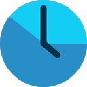

<div align='center'>
    
    <h1>Browser screen time</h1>
</div>

[](https://www.gnu.org/licenses/lgpl-3.0.en.html)

Browser screen time is an extension which helps you track of the amount of time you spend online

## Downloading the extension

### Chrome
https://chrome.google.com/webstore/detail/browser-screen-time/nlkcecddkejakmaipagbcemeohfomedn

### Firefox
https://addons.mozilla.org/en-US/firefox/addon/browser-screen-time

## Building the extension
Run ```npm install``` to install dependencies, then ```npm run dev``` to build, or ```npm run watch``` to build and then watch for changes.